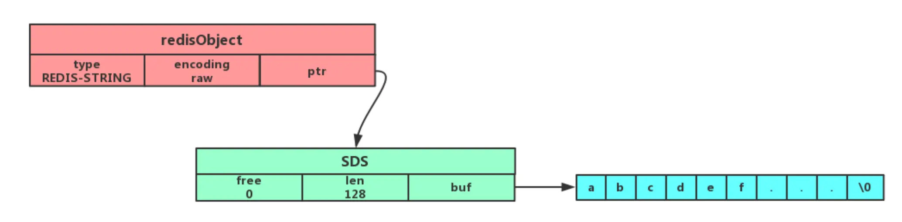

# Redis 数据结构

每种数据对象都各自的应用场景，你能说出它们各自的应用场景吗？

举例一个应用场景来问你，让你说使用哪种 Redis 数据类型来实现。

## String（字符串）

key-value 结构，key 是唯一标识，value 是具体的值。

### 内部实现

String 类型的底层的数据结构实现主要是 `int` 和 `SDS`，简单而言就是自己记录了长度的包含`char*`的数据结构。

可以用于保存文本，和二进制数据，并且获取数据长度的事件复杂度为O(1)，这也很简单。
因为记录了长度，然后因为自己知道长度，所以拼接的时候不会溢出。

在long范围内的整数值，并且这个整数值可以用long类型来表示，那么字符串对象会将整数值保存在字符串对象结构的ptr属性里面（将void*转换成 long），并将字符串对象的编码设置为int。

TODO long 范围外的int呢？

字符串，并且这个字符申的长度小于等于 `X` 字节，那么字符串对象将使用一个简单动态字符串（SDS）来保存这个字符串，并将对象的编码设置为embstr， embstr编码是专门用于保存短字符串的一种优化编码方式。


字符串，并且这个字符串的长度大于 `X` 字节，那么字符串对象将使用一个简单动态字符串（SDS）来保存这个字符串，并将对象的编码设置为raw


#### embstr和raw区别

embstr和raw编码都会使用SDS来保存值，但不同之处在于：

embstr初始化的时候只是用一次malloc（我记得Redis用的不是C自带的malloc，而是用了一个对redis而言更好的）同时分配了redisObject和SDS的内存。
这样好处是，内存是连续的，对CPU缓存有利，并且malloc和free都只用调用一次，就能提高性能。
缺点是，如果要重新分配内存，redisObject+SDS都要重新分配（疑问：就不能只free后半部分么），相当于删除后重新add了一次。

而raw编码会通过调用两次内存分配函数来分别分配两块空间来保存redisObject和SDS。

这种优化都是Redis内部的取舍，和业务没啥关系，不用想太多。除非你遇到了瓶颈需要优化Redis，这时候你可能就要根据业务数据的特点定制这些边界和限制了，反正我没到有谁做过，八股文也没见过。

#### SDS没啥用的小知识

embstr 编码和 raw 编码的边界`X`在 redis 不同版本中是不一样的：
redis 2.+ 是 32 字节
redis 3.0-4.0 是 39 字节
redis 5.0 是 44 字节

### 常用指令

TODO

### 应用场景

#### 缓存对象

1. 直接缓存整个对象的 JSON，命令例子： `SET user:1 '{"name":"xiaolin", "age":18}'`。
2. 采用将 key 进行分离为 user:ID:属性，采用 MSET 存储，用 MGET 获取各属性值，命令例子： `MSET user:1:name xiaolin user:1:age 18 user:2:name xiaomei user:2:age 20`。

#### 分布式锁

SET 命令有个 NX 参数可以实现「key不存在才插入」，可以用它来实现分布式锁：

* 如果 key 不存在，则显示插入成功，可以用来表示加锁成功；
* 如果 key 存在，则会显示插入失败，可以用来表示加锁失败。

SET 命令还有个PX参数控制key的过期时间，单位为毫秒，分布式锁场景下用于避免锁无法释放

加锁示例：`SET lock_key unique_value NX PX 10000`

解锁示例：按照xiaolincoding，解锁要判断这个锁是不是自己设置的，所以用lua脚本进行释放。

```lua
// 释放锁时，先比较 unique_value 是否相等，避免锁的误释放
if redis.call("get",KEYS[1]) == ARGV[1] then
    return redis.call("del",KEYS[1])
else
    return 0
end
```

这样一来，就通过使用 SET 命令和 Lua 脚本在 Redis**单节点**上完成了分布式锁的加锁和解锁。

TODO：真的可能出现这种场景么？不是自己加的锁，怎么可能走到解锁这一步呢？难道是因为超时设置的不对么，还是因为代码bug？

#### 共享 Session 信息

现在真的需要么？

在开发后台管理系统时，会使用 Session 来保存用户的会话(登录)状态，这些 Session 信息会被保存在服务器端，但这只适用于单系统应用，如果是分布式系统此模式将不再适用。

例如用户一的 Session 信息被存储在服务器一，但第二次访问时用户一被分配到服务器二，这个时候服务器并没有用户一的 Session 信息，就会出现需要重复登录的问题，问题在于分布式系统每次会把请求随机分配到不同的服务器。

因此，我们需要借助 Redis 对这些 Session 信息进行统一的存储和管理，这样无论请求发送到那台服务器，服务器都会去同一个 Redis 获取相关的 Session 信息，这样就解决了分布式系统下 Session 存储的问题。

#### 常规计数

Redis 处理命令是单线程，所以执行命令的过程是原子的。

```bash
# 初始化文章的阅读量
> SET aritcle:readcount:1001 0
OK
#阅读量+1
> INCR aritcle:readcount:1001
(integer) 1
#阅读量+1
> INCR aritcle:readcount:1001
(integer) 2
#阅读量+1
> INCR aritcle:readcount:1001
(integer) 3
# 获取对应文章的阅读量
> GET aritcle:readcount:1001
"3"
```

## List（列表）

List 列表是简单的字符串列表，按照插入顺序排序，可以从头部或尾部向 List 列表添加元素。

### 内部实现

早期版本双向链表或压缩列表实现，后期版本由quicklist 实现。

### 常用指令

常用指令中允许列表的没有写[key...] 这种形式，个人认为太容易被误解了，以为[]是命令的一部分

```bash
# 将一个或多个值value插入到key列表的表头(最左边)，顺序就像是一个一个分别插入一样
LPUSH key value1 value2 ...
# 将一个或多个值value插入到key列表的表尾(最右边)
RPUSH key value1 value2 ...
# 移除并返回key列表的头元素
LPOP key     
# 移除并返回key列表的尾元素
RPOP key 

# 返回列表key中指定区间内的元素，区间以偏移量start和stop指定，从0开始，start和stop都包含
LRANGE key start stop

# 从key列表表头弹出一个元素，没有就阻塞timeout秒，如果timeout=0则一直阻塞
# 可以同时监听多个，只要有一个有就返回
BLPOP key1 key2 ... timeout
# 从key列表表尾弹出一个元素，没有就阻塞timeout秒，如果timeout=0则一直阻塞
BRPOP key1 key2 ... timeout
```

### 应用场景

#### 消息队列

满足：顺序，去重和可靠性的要求

顺序保证：List 可以使用 LPUSH + RPOP （或者反过来，RPUSH+LPOP）命令实现消息队列。
潜在的性能问题：是一个轮询的场景，新消息写入List，消费者也要不停地调用 RPOP 命令，这就会导致消费者程序的 CPU 一直消耗在执行 RPOP 命令上，带来不必要的性能损失。可以使用BRPOP，带超时的轮询进行处理。

TODO：顺序场景，就算保证消费者是顺序的，怎么保证生产者的发送一定是顺序的呢？

消息去重：List 并不会为每个消息生成 ID 号，所以我们需要自行为每个消息生成一个全局唯一ID，生成之后，我们在用 LPUSH 命令把消息插入 List 时，需要在消息中包含这个全局唯一 ID。说白了，自己定义唯一ID和结合数据库进行去重逻辑。

可靠性：使用LPOP和RPOP命令的时候，会将数据从list删除，此时若消费者出现崩溃等情况，会导致消息丢失。为了留存消息，List 类型提供了 BRPOPLPUSH 命令，这个命令的作用是让消费者程序从一个 List 中读取消息，同时，Redis 会把这个消息再插入到另一个 List（可以叫作备份 List）留存。这样一来，如果消费者程序读了消息但没能正常处理，等它重启后，就可以从备份 List 中重新读取消息并进行处理了。

缺陷：List 不支持多个消费者消费同一条消息，纯SQS模型。

## Hash（哈希）

hash本身是一个key-value结构，但是其value内寸的是多个key-value结构，形如value=[{field1，value1}，...{fieldN，valueN}]，所以可以用key+field存取数据

### 内部实现

早期版本压缩列表或者哈希表，7.0后 listpack 数据结构。

### 常用指令

```bash
# 存储一个哈希表key的键值
HSET key field value   
# 获取哈希表key对应的field键值
HGET key field

# 在一个哈希表key中存储多个键值对
HMSET key field value [field value...] 
# 批量获取哈希表key中多个field键值
HMGET key field [field ...]       
# 删除哈希表key中的field键值
HDEL key field [field ...]    

# 返回哈希表key中field的数量
HLEN key       
# 返回哈希表key中所有的键值
HGETALL key 

# 为哈希表key中field键的值加上增量n
HINCRBY key field n 
```

### 应用场景

#### 缓存对象

很简单，直接举例说明了

```bash
# 存储一个哈希表uid:1的键值
> HMSET uid:1 name Tom age 15
2
# 存储一个哈希表uid:2的键值
> HMSET uid:2 name Jerry age 13
2
# 获取哈希表用户id为1中所有的键值
> HGETALL uid:1
1) "name"
2) "Tom"
3) "age"
4) "15"
```

**到底是用hash还是string存储对象呢？**一般对象用 String + Json 存储，对象中某些频繁变化的属性可以考虑抽出来用 Hash 类型存储。（TODO 解释为什么）

#### 购物车类场景

以用户 id 为 key，商品 id 为 field，商品数量为 value，恰好构成了购物车的3个要素，如下所示。

* 添加商品：HSET cart:{用户id} {商品id} 1
* 添加数量：HINCRBY cart:{用户id} {商品id} 1
* 商品总数：HLEN cart:{用户id}
* 删除商品：HDEL cart:{用户id} {商品id}
* 获取购物车所有商品：HGETALL cart:{用户id}

## Set（集合）

序并唯一的键值集合，一个集合最多可以存储 `2^32-1` 个元素

类型除了支持集合内的**增删改查**，同时还支持多个集合取**交集、并集、差集**，集合运算的复杂度较高，简单来说负载高会卡。

### 内部实现

Set 类型的底层数据结构是由哈希表或整数集合实现的：

* 如果集合中的元素都是整数且元素个数小于 512 （默认值，set-maxintset-entries配置）个，Redis 会使用整数集合作为 Set 类型的底层数据结构；
* 如果集合中的元素不满足上面条件，则 Redis 使用哈希表作为 Set 类型的底层数据结构。

### 常用指令

```bash
# 往集合key中存入元素，元素存在则忽略，若key不存在则新建
SADD key member [member ...]
# 从集合key中删除元素
SREM key member [member ...] 
# 获取集合key中所有元素
SMEMBERS key
# 获取集合key中的元素个数
SCARD key

# 判断member元素是否存在于集合key中
SISMEMBER key member

# 从集合key中随机选出count个元素，元素不从key中删除
SRANDMEMBER key [count]
# 从集合key中随机选出count个元素，元素从key中删除
SPOP key [count]
```

```bash
# 交集运算
SINTER key [key ...]
# 将交集结果存入新集合destination中
SINTERSTORE destination key [key ...]

# 并集运算
SUNION key [key ...]
# 将并集结果存入新集合destination中
SUNIONSTORE destination key [key ...]

# 差集运算
SDIFF key [key ...]
# 将差集结果存入新集合destination中
SDIFFSTORE destination key [key ...]
```

### 应用场景

#### 点赞

```BASH
# uid:1 用户对文章 article:1 点赞
> SADD article:1 uid:1
(integer) 1
# uid:2 用户对文章 article:1 点赞
> SADD article:1 uid:2
(integer) 1
# uid:3 用户对文章 article:1 点赞
> SADD article:1 uid:3
(integer) 1
# uid:1 取消了对 article:1 文章点赞。
> SREM article:1 uid:1
(integer) 1
# 获取 article:1 文章所有点赞用户 :
> SMEMBERS article:1
1) "uid:3"
2) "uid:2"
# 获取 article:1 文章的点赞用户数量：
> SCARD article:1
(integer) 2
# 判断用户 uid:1 是否对文章 article:1 点赞了：
> SISMEMBER article:1 uid:1
(integer) 0  # 返回0说明没点赞，返回1则说明点赞了
```

#### 共同关注

取交集即可，感觉很勉强的场景

#### 抽奖活动去重

key为活动，value为可以参加的用户，一次可以随机取出一个，然后pop，感觉也很勉强

## Zset（有序集合）

相比于 Set 类型多了一个排序属性 score（分值），可以按照排序对数据进行操作，但是支持交集和并集，不支持差集

### 内部实现

早期版本压缩列表或跳表，7.0后 listpack或者跳表

### 常用指令

```bash
# 往有序集合key中加入带分值元素
ZADD key score member [[score member]...]   
# 往有序集合key中删除元素
ZREM key member [member...]                 
# 返回有序集合key中元素member的分值
ZSCORE key member
# 返回有序集合key中元素个数
ZCARD key 

# 为有序集合key中元素member的分值加上increment
ZINCRBY key increment member 

# 正序获取有序集合key从start下标到stop下标的元素
ZRANGE key start stop [WITHSCORES]
# 倒序获取有序集合key从start下标到stop下标的元素
ZREVRANGE key start stop [WITHSCORES]

# 返回有序集合中指定分数区间内的成员，分数由低到高排序。
ZRANGEBYSCORE key min max [WITHSCORES] [LIMIT offset count]

# 返回指定成员区间内的成员，按字典正序排列, 分数必须相同。
ZRANGEBYLEX key min max [LIMIT offset count]
# 返回指定成员区间内的成员，按字典倒序排列, 分数必须相同
ZREVRANGEBYLEX key max min [LIMIT offset count]
```

```bash
# 并集计算(相同元素分值相加)，numberkeys一共多少个key，WEIGHTS每个key对应的分值乘积
ZUNIONSTORE destkey numberkeys key [key...] [WEIGHTS weight [weight ...]]
# 交集计算(相同元素分值相加)，numberkeys一共多少个key，WEIGHTS每个key对应的分值乘积
ZINTERSTORE destkey numberkeys key [key...] [WEIGHTS weight [weight ...]]

```

### 应用场景

#### 排行榜

以博文点赞排名为例，小林发表了五篇博文，分别获得赞为 200、40、100、50、150。

```
# arcticle:1 文章获得了200个赞
> ZADD user:xiaolin:ranking 200 arcticle:1
(integer) 1
# arcticle:2 文章获得了40个赞
> ZADD user:xiaolin:ranking 40 arcticle:2
(integer) 1
# arcticle:3 文章获得了100个赞
> ZADD user:xiaolin:ranking 100 arcticle:3
(integer) 1
# arcticle:4 文章获得了50个赞
> ZADD user:xiaolin:ranking 50 arcticle:4
(integer) 1
# arcticle:5 文章获得了150个赞
> ZADD user:xiaolin:ranking 150 arcticle:5
(integer) 1
```

新增一个赞，可以使用 ZINCRBY 命令`ZINCRBY user:xiaolin:ranking 1 arcticle:4`

查看某篇文章的赞数，可以使用 ZSCORE 命令`ZSCORE user:xiaolin:ranking arcticle:4`

获取小林文章赞数最多的 3 篇文章，可以使用 ZREVRANGE 命令 `ZREVRANGE user:xiaolin:ranking 0 2 WITHSCORES`

获取小林 100 赞到 200 赞的文章，可以使用 ZRANGEBYSCORE 命令 `ZRANGEBYSCORE user:xiaolin:ranking 100 200 WITHSCORES`

## BitMap

一串连续的二进制数组（0和1），可以通过偏移量（offset）定位元素。

### 内部实现

string，利用string的每一位存储0/1数据，所以string类型也可以直接bit操作

### 常用指令

```bash
# 设置值，其中value只能是 0 和 1
SETBIT key offset value

# 获取值
GETBIT key offset

# 获取指定范围内值为 1 的个数
# start 和 end 以字节为单位
BITCOUNT key start end

# 运算操作 https://redis.com.cn/commands/bitop.html
BITOP [operations] [result] [key1] [keyn…]
```

### 应用场景

#### 签到统计

每个用户一天的签到用 1 个 bit 位就能表示，一个月（假设是 31 天）的签到情况用 31 个 bit 位就可以，而一年的签到也只需要用 365 个 bit 位，根本不用太复杂的集合类型。

只要setbit getbit bitcount，就很容易实现存储和统计的功能
也有 BITPOS key bitValue [start] [end]指令，返回数据表示 Bitmap 中第一个值为 bitValue 的 offset 位置。

#### 判断用户登陆态

只需要一个 key = login_status 表示存储用户登陆状态集合数据， 将用户 ID 作为 offset，在线就设置为 1，下线设置 0。
通过 GETBIT判断对应的用户是否在线。 5000 万用户只需要 6 MB 的空间。

#### 连续签到用户总数

把每天的日期作为 Bitmap 的 key，userId 作为 offset，若是打卡则将 offset 位置的 bit 设置成 1。

只需要把指定日期的数据做AND运算就能得到这几天连续签到的用户了

## HyperLogLog

每个 HyperLogLog 键只需要花费 12 KB 内存，就可以计算接近 2^64 个不同元素的基数

### 常见指令

```bash
# 添加指定元素到 HyperLogLog 中
PFADD key element [element ...]

# 返回给定 HyperLogLog 的基数估算值。
PFCOUNT key [key ...]

# 将多个 HyperLogLog 合并为一个 HyperLogLog
PFMERGE destkey sourcekey [sourcekey ...]
```

### 应用场景

适用于可以接受误差的统计

#### 活跃用户计数

例如：在统计 UV 时，你可以用 PFADD 命令（用于向 HyperLogLog 中添加新元素）把访问页面的每个用户都添加到 HyperLogLog 中。

PFADD page1:uv user1 user2 user3 user4 user5

用 PFCOUNT 命令直接获得 page1 的 UV 值了，这个命令的作用就是返回 HyperLogLog 的统计结果。

PFCOUNT page1:uv

## GEO

TODO：不是太重要，暂时跳过

## Stream

Redis 专门为消息队列设计的数据类型。

支持消息的持久化、支持自动生成全局唯一 ID、支持 ack 确认消息的模式、支持消费组模式等，让消息队列更加的稳定和可靠。

# Redis 持久化

## AOF

AOF(Append Only File)是Redis的持久化机制之一，使用日志对数据库进行持久化

Redis 是先执行写操作命令后，才将该命令记录到 AOF 日志里的
第一个好处，避免额外的检查开销。
第二个好处，不会阻塞当前写操作命令的执行

会有丢失的风险
可能会给「下一个」命令带来阻塞风险。因为执行和写AOF是一个线程。

### AOF的三种回写策略

Redis 执行完写操作命令后，会将命令追加到 server.aof_buf 缓冲区；
然后通过 write() 系统调用，将 aof_buf 缓冲区的数据写入到 AOF 文件，此时数据并没有写入到硬盘，而是拷贝到了内核缓冲区 page cache，等待内核将数据写入硬盘；
具体内核缓冲区的数据什么时候写入到硬盘，由内核决定。

下面这三种策略只是调用fsync的时机不同而已，上述的保存过程不变

* Always，每次写操作命令执行完后，同步将 AOF 日志数据写回硬盘；
* Everysec，每次写操作命令执行完后，先将命令写入到 AOF 文件的内核缓冲区，然后每隔一秒在子线程将缓冲区里的内容写回到硬盘；
* No，意味着不由 Redis 控制写回硬盘的时机，转交给操作系统控制写回的时机，也就是每次写操作命令执行完后，先将命令写入到 AOF文件的内核缓冲区，再由操作系统决定何时将缓冲区内容写回硬盘。

无论哪种都保证不了数据的绝对安全。

### AOF 重写机制

随着执行的写操作命令越来越多，AOF文件的大小会越来越大，就会带来性能问题。
比如重启 Redis 后，需要读 AOF 文件的内容以恢复数据，如果文件过大，整个恢复的过程就会很慢。

这里就引入了**AOF重写机制**，当 AOF 文件的大小超过所设定的阈值后，Redis 就会启用 AOF 重写机制。

AOF会扫描数据库中所有的KV，然后写入到文件中，这样就做到了保存数据库的最新状态，去除了无效的set数据。

AOF重写是写到一个新的文件中的，而不是原来的AOF文件，这是为了防止重写过程中出错，导致所有的AOF日志不可用。

### AOF 后台重写

这一节还是讲AOF重写机制，主要说明AOF重写不是在主线程，二是AOF重写如何处理在重写的过程中发生的数据变更

AOF重写会扫描整个数据库，为了避免在扫描影响性能，肯定不能放主线程里，所以AOF重写是后台子**进程**bgrewriteaof干的。

1. 避免阻塞主线程
2. 子进程利用了COPY-ON-WRITE 机制，子进程fork的时候复制了父进程的页表，带有主进程的内存数据副本，子进程会以只读的形式共享父进程的内存数据，父子进程在修改数据的时候数据才会发生写时复制，拥有独立的内存副本，不用像线程那样存在内存安全问题。

那么在重写过程中，redis主进程出现了数据更新会怎么样呢？
Redis 设置了一个 AOF 重写缓冲区，这个缓冲区在创建 bgrewriteaof 子进程之后开始使用。在重写 AOF 期间，当 Redis 执行完一个写命令之后，它会同时将这个写命令写入到 「AOF 缓冲区」和 「AOF 重写缓冲区」。

简单来讲，就是把新的命令写到了一个新的AOF文件里，然后把重写后的AOF文件和新的AOF文件拼起来就行，很简单，最新的状态一定是对的，就是可能对多几个set而已，对正确性没有影响。

## RDB

RDB 快照就是记录某一个瞬间的内存数据，记录的是实际数据，而 AOF 文件记录的是命令操作的日志，而不是实际的数据。
恢复效率会比AOF高。

### RDB的后台保存

RDB可以在前台保存和后台保存，前台保存会阻塞主线程，后台保存不会阻塞，所以都配置后台保存。

RDB后台保存的原理和AOF重写类似，都是依赖于子进程的copy-on-write。
对于后台保存期间的数据更新，依然是使用AOF日志进行记录，保存的RDB和AOF组合起来，就反映了数据库的最新状态

## 大Key对持久化的影响

这一节不属于持久化技术，但是与持久化相关，因为大key会影响reids性能，包括持久化性能

### 对AOF的影响

Always下，如果写入是一个大 Key，主线程在执行 fsync() 函数的时候，阻塞的时间会比较久，因为当写入的数据量很大的时候，数据同步到硬盘这个过程是很耗时的。

当使用 Everysec 策略的时候，由于是异步执行 fsync() 函数，所以大 Key 持久化的过程（数据同步磁盘）不会影响主线程。

当使用 No 策略的时候，由于永不执行 fsync() 函数，所以大 Key 持久化的过程不会影响主线程。

TODO？真的么，我真的怀疑

### 对AOF重写的影响和对RDB的影响

AOF 重写机制和 RDB 快照（bgsave 命令）的过程，都会分别通过 fork() 函数创建一个子进程来处理任务。

在创建子进程的过程中，操作系统会把父进程的「页表」复制一份给子进程，随着 Redis 存在越来越多的大 Key，那么 Redis 就会占用很多内存，对应的页表就会越大，复制时间就越多，就阻塞了。

类似的原因，由于COPY-ON-WRITE机制，在AOF重写或者RDB快照的时候，如果大key被修改，那么就会发生写时复制，要修改的内存越多，
对性能的影响也就越大。

如果 Linux 开启了内存大页，也会影响 Redis 的性能的，原因是写时复制发生的时候，复制是按照页为单位进行的，
如果页比较大，肯定也会比小页耗时

### 大key的其他影响

1. 客户端超时堵塞，Redis单线程处理，操作大Key比较耗时，就会导致阻塞。
2. 网络阻塞，key比较大，访问多了就会导致网络流量增大
3. 阻塞redis工作线程。如使用del删除大key，就导致了主线程阻塞，无法处理后续的命令。
4. 内存分配不均，集群在slot分配的情况下，会出现数据和查询倾斜。

### 大Key的优化方案

1. 单个实例的内存不要太大（网上说是10GB以下），让fork函数能够尽快完成
2. 不关心数据安全的场景，可以关掉AOF和AOF重写
3. 主从架构中，适当调大repl-backlog-size，避免因为 repl_backlog_buffer 不够大，导致主节点频繁地使用全量同步的方式，全量同步的时候，是会创建 RDB 文件的，也就是会调用 fork 函数。
4. 避免大key，把大key拆分或者定时检查大key。
5. 删除大key的时候不用del，用unlink异步删除。

# Redis 集群

暂时直接看总结和面试题部分
<https://xiaolincoding.com/redis/cluster/master_slave_replication.html>

## 主从复制原理

## 哨兵模式

## 集群模式Redis Cluster

哨兵模式每台机器都是一样的数据，显然，浪费内存，且性能差

# Redis 过期删除与内存淘汰

# Redis缓存一致性
