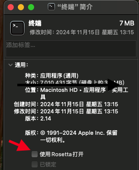

# index

新购入一台 M4 Mac mini，记录配置这台 Mac mini 的过程

不包括如何进行科学上网

## 安装 Homebrew

安装 Homebrew 相对简单，记住不要下载官网上提供的 pkg 安装包，而是通过命令行来安装。
pkg 安装好之后，依然存在各种问题，典型的就是 shell 没有配置正确

1. 首先安装 xcode cli

   ```bash
   xcode-select --install
   ```

2. 然后安装 Homebrew

   ```bash
   bin/bash -c "$(curl -fsSL https://raw.githubusercontent.com/Homebrew/install/HEAD/install.sh)"
   ```

## 安装 git

借助 Homebrew，快速安装 git。

```bash
brew install git
```

## 安装 oh-my-zsh

oh-my-zsh 是一个非常流行的终端主题和插件管理器。它可以帮助你快速配置你的终端环境。

总之 有了 oh-my-zsh，就可以轻松地使用命令行了。
需要尽早安装，否则安装的软件过多之后，安装 oh-my-zsh 会覆盖.zshrc 文件。

```bash
sh -c "$(curl -fsSL https://raw.githubusercontent.com/ohmyzsh/ohmyzsh/master/tools/install.sh)"
```

## 安装 Java

可以使用 brew 安装 java
但是推荐使用 sdkman 来安装 java，因为 sdkman 可以更方便的管理多个版本的 java。

## 安装 Node

1. 推荐使用 NVM 安装管理 Node，虽然 brew 也可以安装 node，但是 nvm 会更加的方便多版本 node 的管理。
2. 不推荐使用 brew 安装 NVM，NVM 开发团队对使用 brew 安装的 NVM 表示不支持。
3. 直接使用命令行安装 NVM

   ```bash
   curl -o- https://raw.githubusercontent.com/nvm-sh/nvm/v0.40.1/install.sh | bash
   ```

4. 安装 Node

   ```bash
   nvm install 20
   ```

5. 设置 npm 国内源

   ```bash
   npm config set registry https://registry.npmmirror.com/
   ```

6. 处理低版本 Node 与 arm 架构的兼容性问题

   如果使用 nvm 安装低版本 Node，可能会遇到以下错误：

   > env: node: Bad CPU type in executable

   因为对于 16 以下的 node，没有提供官方的 arm 编译版本。
   可以通过 Rosetta2 来解决这个问题。

   1. 确保终端 App 已经完全退出

   2. 在 Application 中找到终端，右键点击终端图标，选择“显示简介”
      在弹出的窗口中，勾选`使用 Rosetta 打开`

      

   3. 打开终端，安装你想安装的低版本 Node，例如

      ```bash
      nvm install 12
      ```

   4. 取消勾选 2 中的`使用 Rosetta 打开`

   5. 你的 Node 就应该可以正常工作了

## 安装 Python

在使用 brew 安装 python 前，需要注意以下两点

1. 无论如何不要使用系统自带的 python，这是给系统服务用的，如果自己安装包损坏了环境，可能会导致系统不稳定。

2. 使用 brew 安装 Python 是最简单的方法，但是不推荐使用 brew 安装的 python 作为自己的开发环境，因为 brew 安装的 Python 会随着其他软件一起更新，并且会定期 brew clean，导致你的开发环境不稳定。如果一定使用 brew 安装的 python
   作为开发环境，建议善用虚拟环境来管理你的项目依赖。

此处仅记录通过 homebrew 安装 python 并使用，不包含虚拟环境的使用教程。

```bash
brew install python
```

默认会安装最新版本的 python，如果需要指定版本，可以使用以下命令

```bash
brew install python@3.11
```

在安装完成后，会发现，python3 依然指向系统自带的 python，此时需要修改环境变量，将 brew 安装的 python 添加到系统的 PATH 中。以 Python3.11 为例，修改环境变量如下：

```bash
export PATH="$(brew --prefix)/opt/python@3.11/libexec/bin:$PATH"
```

善于使用 brew info 找到正确的路径，然后将该路径添加到 PATH 中即可。下面的输出明确指出了 python bin 安装的位置在
`/opt/homebrew/opt/python@3.13/libexec/bin`

```text
➜  ~ brew info python
==> python@3.13: stable 3.13.0 (bottled)
Interpreted, interactive, object-oriented programming language
https://www.python.org/
Not installed
Bottle Size: 15.4MB
Installed Size: 60.8MB
From: https://github.com/Homebrew/homebrew-core/blob/HEAD/Formula/p/python@3.13.rb
License: Python-2.0
==> Dependencies
Build: pkgconf ✘
Required: mpdecimal ✘, openssl@3 ✘, sqlite ✘, xz ✘
==> Caveats
Python is installed as
  /opt/homebrew/bin/python3

Unversioned symlinks `python`, `python-config`, `pip` etc. pointing to
`python3`, `python3-config`, `pip3` etc., respectively, are installed into
  /opt/homebrew/opt/python@3.13/libexec/bin

See: https://docs.brew.sh/Homebrew-and-Python
```
