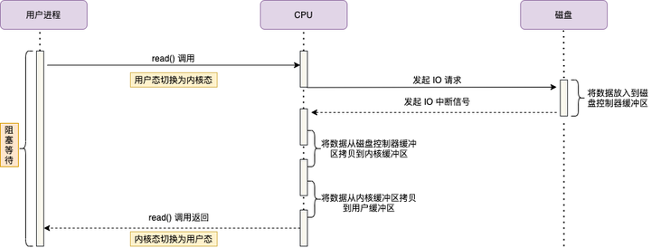
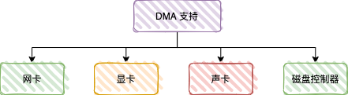
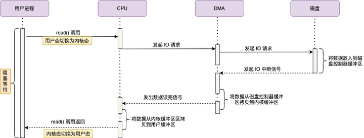
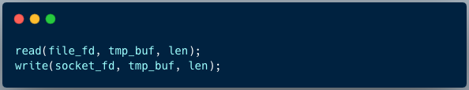
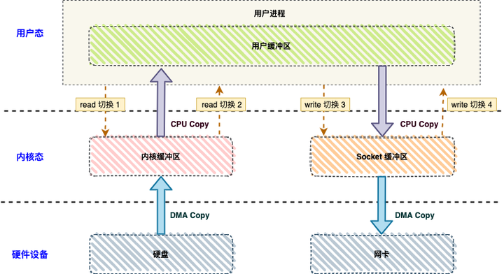
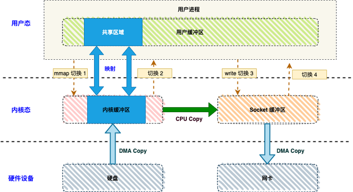
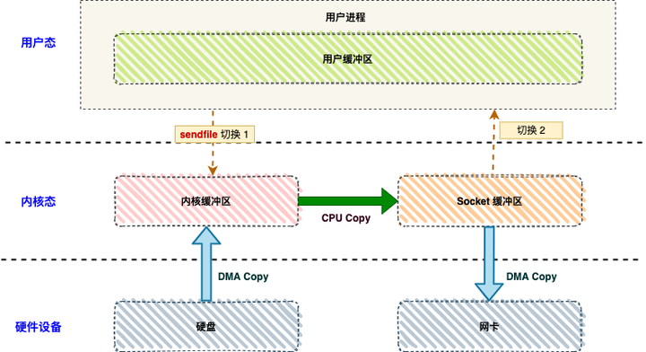
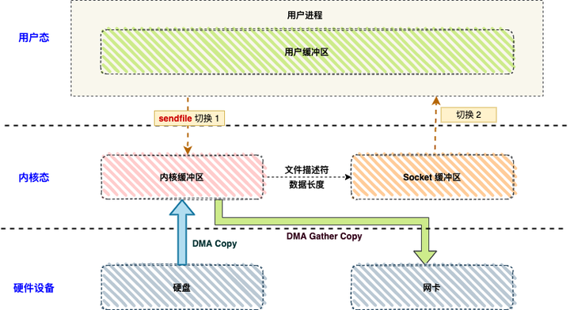

零拷贝技术 Zero-Copy 是指计算机执行操作时，CPU 不需要先将数据从某处内存复制到另一个特定区域，从而可以减少上下文切换以及 CPU 的拷贝时间。

# 1 I/O 中断原理

在 DMA 技术出现之前，应用程序与磁盘之间的 I/O 操作都是通过 CPU 的中断完成的。

1. 用户进程向 CPU 发起 read 系统调用读取数据，由用户态切换为内核态，然后一直阻塞等待数据的返回。
2. CPU 在接收到指令以后对磁盘发起 I/O 请求，将磁盘数据先放入磁盘控制器缓冲区。
3. 数据准备完成以后，磁盘向 CPU 发起 I/O 中断。
4. CPU 收到 I/O 中断以后将磁盘缓冲区中的数据拷贝到内核缓冲区，然后再从内核缓冲区拷贝到用户缓冲区。
5. 用户进程由内核态切换回用户态，解除阻塞状态，然后等待 CPU 的下一个执行时间钟。

可以看到，整个数据的传输过程，都要需要 CPU 亲自参与搬运数据的过程，而且这个过程，CPU 是不能做其他事情的。

假如通过千兆网卡或者磁盘传输大量数据时，使用 CPU 来拷贝的话，对 CPU 资源是种极大的消耗。

# 2 DMA 方式

DMA 的全称是直接内存访问（Direct Memory Access），是一种硬件设备绕开 CPU 独立直接访问内存的机制。

目前支持 DMA 的硬件包括：网卡、声卡、显卡、磁盘控制器等。

基于 DMA 访问方式，系统主内存于硬盘或网卡之间的数据传输可以绕开 CPU 的全程调度，数据搬运的工作交给 DMA 控制器，在传输过程中，CPU 可以继续处理其他的工作，提升系统的资源利用率。 

1. 用户进程向 CPU 发起 read 系统调用读取数据，用户态切换为内核态，然后一直阻塞等待数据的返回。
2. CPU 在接收到指令以后对 DMA 磁盘控制器发起调度指令。
3. DMA 磁盘控制器对磁盘发起 I/O 请求，将磁盘数据先拷贝到磁盘控制器缓冲区，CPU 全程不参与此过程。
4. 数据读取完成后，DMA 磁盘控制器会接受到磁盘的通知，将数据从磁盘控制器缓冲区拷贝到内核缓冲区。
5. DMA 磁盘控制器向 CPU 发出数据读完的信号，由 CPU 负责将数据从内核缓冲区拷贝到用户缓冲区。
6. 用户进程由内核态切换回用户态，解除阻塞状态，然后等待 CPU 的下一个执行时间钟。

# 3 传统 I/O 方式

为了理解零拷贝技术的思路，首先了解一下传统 I/O 方式存在的问题。

 Linux 系统中，传统的访问方式是通过 write() 和 read() 两个系统调用实现的，通过 read()  函数读取文件到到缓存区中，然后通过 write() 方法把缓存中的数据输出到网络端口 。

下图分别对应传统 I/O 操作的数据读写流程，**整个过程涉及 4 次上下文切换、 2 次 CPU 拷贝、2 次 DMA 拷贝总共 4 次拷贝**。

- **4 次上下文切换**

因为发生了两次系统调用，一次是 `read()` ，一次是 `write()`，用户程序向内核发起系统调用时，CPU 将用户进程从用户态切换到内核态；当系统调用返回时，CPU 将用户进程从内核态切换回用户态。

- **4 次 数据拷贝**

1. 第一次 DMA 拷贝，将磁盘上的数据拷贝到操作系统内核的缓冲区 ；
2. 第二次 CPU 拷贝，将内核缓冲区的数据拷贝到用户的缓冲区里；
3. 第三次 CPU 拷贝，将用户缓冲区的数据，拷贝到内核 Socket 缓冲区；
4. 第四次 DMA 拷贝，将内核 Socket 缓冲区的数据拷贝到网卡的缓冲区。

综上，想要提升文件传输的性能，因此我们需要减少「**上下文切换**」和「**数据拷贝**」的次数。

# 3 零拷贝方式

零拷贝技术实现的方式通常有 2 种：mmap + write 、sendfile、sendfile + DMA scatter-gather 。

# 3.1 mmap + write

mmap 是 Linux 提供的一种内存映射文件的机制，它实现了将内核中读缓冲区地址与用户空间缓冲区地址进行映射，从而实现内核缓冲区与用户缓冲区的共享。

基于 mmap + write 系统调用的零拷贝方式，整个拷贝过程会发生 4 次上下文切换，1 次 CPU 拷贝和 2 次 DMA 拷贝。

用户程序读写数据的流程如下：

1. 用户进程通过 mmap() 函数向内核发起系统调用，上下文从用户态切换为内核态。
2. 将用户进程的内核空间的读缓冲区与用户空间的缓存区进行内存地址映射。
3. CPU 利用 DMA 控制器将数据从主存或硬盘拷贝到内核空间的读缓冲区。
4. 上下文从内核态切换回用户态，mmap 系统调用执行返回。
5. 用户进程通过 write() 函数向内核发起系统调用，上下文从用户态切换为内核态。
6. CPU 将读缓冲区中的数据拷贝到的网络缓冲区。
7. CPU 利用 DMA 控制器将数据从网络缓冲区（socket buffer）拷贝到网卡进行数据传输。
8. 上下文从内核态切换回用户态，write 系统调用执行返回。

mmap 的拷贝虽然减少了 1 次 CPU 拷贝，提升了效率，但也存在一些隐藏的问题。

当 mmap 一个文件时，如果这个文件被另一个进程所截获，那么 write 系统调用会因为访问非法地址被 SIGBUS 信号终止，SIGBUS 默认会杀死进程并产生一个 coredump，服务器可能因此被终止。

# 3.2 sendfile 

sendfile 系统调用在 Linux 内核版本 2.1 中被引入，目的是简化通过网络在两个通道之间进行的数据传输过程。

通过 sendfile 系统调用，数据可以直接在内核空间内部进行 I/O 传输，从而省去了数据在用户空间和内核空间之间的来回拷贝。

sendfile 系统调用的引入，不仅减少了 CPU 拷贝的次数，还减少了上下文切换的次数，它的伪代码如下：

基于 sendfile 系统调用的零拷贝方式，整个拷贝过程会发生 2 次上下文切换，1 次 CPU 拷贝和 2 次 DMA 拷贝。

用户程序读写数据的流程如下：

1. 用户进程通过 sendfile() 函数向内核发起系统调用，上下文从用户态切换为内核态。
2. CPU 利用 DMA 控制器将数据从主存或硬盘拷贝到内核空间的读缓冲区。
3. CPU 将读缓冲区中的数据拷贝到的网络缓冲区。
4. CPU 利用 DMA 控制器将数据从网络缓冲区拷贝到网卡进行数据传输。
5. 上下文从内核态切换回用户态，sendfile 系统调用执行返回。

相比较于 mmap 内存映射的方式，sendfile 少了 2 次上下文切换，但是仍然有 1 次 CPU 拷贝操作。

# 3.3 sendfile + DMA gather copy 

Linux 2.4 版本的内核对 sendfile 系统调用进行修改，为 DMA 拷贝引入了 gather 操作。

它将内核空间的读缓冲区中对应的数据描述信息（内存地址、地址偏移量）记录到相应的网络缓冲区中，由 DMA 根据内存地址、地址偏移量将数据批量地从读缓冲区拷贝到网卡设备中，这样就省去了内核空间中仅剩的 1 次 CPU 拷贝操作。

在硬件的支持下，sendfile 拷贝方式不再从内核缓冲区的数据拷贝到 socket 缓冲区，取而代之的仅仅是缓冲区文件描述符和数据长度的拷贝，这样 DMA 引擎直接利用 gather 操作将页缓存中数据打包发送到网络中即可，本质就是和虚拟内存映射的思路类似。

基于 sendfile + DMA gather copy 系统调用的零拷贝方式，整个拷贝过程会发生 2 次上下文切换、0 次 CPU 拷贝以及 2 次 DMA 拷贝，用户程序读写数据的流程如下：

1. 用户进程通过 sendfile() 函数向内核发起系统调用，上下文从用户态切换为内核态。
2. CPU 利用 DMA 控制器将数据从主存或硬盘拷贝到内核空间的读缓冲区。
3. CPU 把读缓冲区的文件描述符（file descriptor）和数据长度拷贝到网络缓冲区。
4. 基于已拷贝的文件描述符和数据长度，CPU 利用 DMA 控制器的 gather/scatter 操作直接批量地将数据从内核的读缓冲区拷贝到网卡进行数据传输。
5. 上下文从内核态切换回用户态，sendfile 系统调用执行返回。

# 5 写到最后

无论是传统 I/O 拷贝方式还是引入零拷贝的方式，2 次 DMA 拷贝是都少不了的，因为两次 DMA 都是依赖硬件完成的。

| 拷贝方式                       | CPU拷贝 | DMA拷贝 | 系统调用         | 上下文切换 |
| -------------------------- | ----- | ----- | ------------ | ----- |
| 传统方式（read + write）         | 2     | 2     | read / write | 4     |
| 内存映射（mmap + write）         | 1     | 2     | mmap / write | 4     |
| sendfile                   | 1     | 2     | sendfile     | 2     |
| sendfile + DMA gather copy | 0     | 2     | sendfile     | 2     |

RocketMQ 选择了 mmap + write 这种零拷贝方式，适用于业务级消息这种小块文件的数据持久化和传输；

而 Kafka 采用的是 sendfile 这种零拷贝方式，适用于系统日志消息这种高吞吐量的大块文件的数据持久化和传输。

Kafka 的索引文件使用的是 mmap + write 方式，数据文件使用的是 sendfile 方式。
