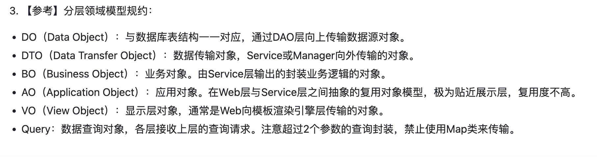
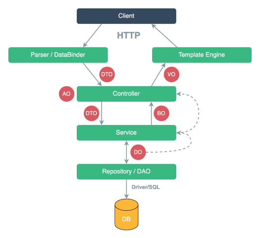
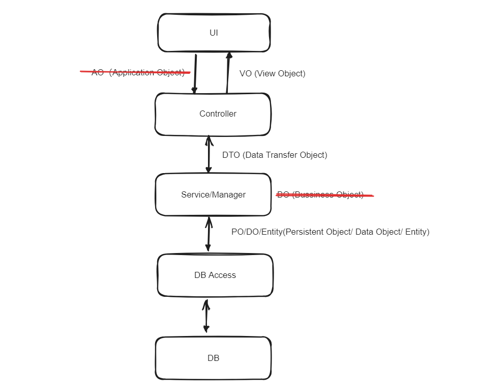

# 概述

当设计和组织 Java 项目时，我们经常会遇到一些常见的概念，比如 DO（Data Object）、VO（View Object）、BO（Business Object）、DTO（Data Transfer Object）、AO（Application Object）等。这些概念在不同的层次和场景中承担着不同的职责。

随着业务的发展，Java 中的 XO 也越来越多，这里我总结一下这些 XO 的概念，以及我自己的用法。



# 单独解释

最常用的就是`DO`、`VO`和`DTO`了，下面我就来单独解释一下这三个概念。再解释其他概念

## DO

`DO` 为`Data Object`数据对象的缩写，通常与数据库中的表相映射，一个表对应一个 `DO`,或许叫做 `Entity` 就更加容易理解了。

下面是一个例子（实际上，真没见过加 `DO` 这两个字母的，直接叫 `USER`）:

```java
public class  UserDO {
    private Integer id;                 //唯一主键
    private String name;                //姓名
    private Integer age;                //年龄
    private String gender;              //性别
}
```

## DTO

根据 wiki 的解释，`DO`为`Data Transfer Object`数据传输对象的缩写，它是在 2 个进程中携带数据的对象。在 web 开发中，经常会出现远程的服务调用，虽然现在流行各种远程调用，但是这种远程的服务调用代价仍然想当昂贵。为了降低这种调用的次数，需要使用 DTO 来进行封装，进行批量的数据传输。

BUT，这好像和我在网上听到的说法不太一样?我听到的说法是，`DTO`是 service 层用于传输数据的对象，在现代的 Java web 开发中，这种说法更加符合实际中`DTO`真正被使用的情况。除了 VO 和 DO 外，其他的都可以叫做 DTO。

仍然以上述的`User`为例，我们可以定义一个`UserDTO`:

```java
public class UserDTO {
    private String fullName;  // 全名
    private Integer userAge;   // 用户年龄
    private String userGender; // 用户性别

}
```

我们可以看到，其实际内容和`UserDO`可以完全一样，也可以不一样，总之，`DTO`是`DO`的一个复制，子集或者是一个扩展，这个根据实际情况而定。`DTO`主要用于在不同层之间传输数据，避免直接传递数据库实体。它简化了传输的数据结构，通常不包含业务逻辑。

## VO

`View Object`表示显示层对象。显示层对象，通常是 Web 向模板渲染引擎层传输的对象。以下是 UserVO 的示例：

```java
public class UserVO {
    private String displayName;  // 显示的姓名
    private Integer displayAge;  // 显示的年龄
    private String displayGender;// 显示的性别
}
```

与 DTO 相同的是，VO 中的属性，是`DO`的一个复制，子集或者是一个扩展，可以完全相同，也可以不同，根据实际情况而定。

## BO

`Business Object`业务对象，与 DTO 不同的是，BO 中可能存在一些业务逻辑和操作，service 层将传入的 DTO 对象转换为 BO 对象，就可以进行一些逻辑上的对象。

BO 和 DTO 在 service 调用中存在相互的转换，比如一个远程服务 A 调用远程服务 B 时，服务 B 将传入的 DTO 转换为 BO，进行一些业务逻辑的操作，然后再将 BO 转换为 DTO，返回给服务 A。说白了，BO 封装了业务的逻辑，而 DTO 只是一个数据的传输，这样做的好处是，可以将业务逻辑和数据传输分离。

```java
public class UserBO {
    private String fullName;  // 全名
    private Integer userAge;   // 用户年龄
    private String userGender; // 用户性别

    public String sayHello() {
        return "Hello, " + fullName;
    }
}
```

## AO

`Application Object`应用对象，DTO 传入 controller 层，controller 层将 DTO 转换为 AO，进行一些业务逻辑的操作，然后再将 AO 转换为 DTO，传给 service。AO 和 BO 的区别在于，AO 是给前端用的，BO 是给后端用的。

# 总概述

这么看来很乱，在网上找到张图总结一下：



# 我自己的用法

## 前端到后端

controller 用 VO 接收前端数据，转换为 DTO 给 service，service 转换为 DO ，给 DAO 增删查改。

## 后端到前端

用 DO 定义数据库实体，然后 service 层调用 DAO 层获取数据库的实体信息，然后转换为 DTO 传给 controller 层，controller 层再转换为 VO 传给前端。

## service 之间传输

使用 DTO 传来传去

## 总结



简而言之，就是数据与前端的来回，都是 VO，service 和数据库的交互，都是 DO，其他的所有对象，都是 DTO，你把逻辑处理也放在 DTO 里，在 service 他就叫 BO，在 controller，他就叫 AO，但是不管怎样，他还是 DTO，只是多了一些逻辑处理而已。对于一般体量的项目，这些足够了

至于网上众说纷纭，可能除了阿里自己，谁都不知道这么多 XO 具体到底是怎么用的吧，这些 O 的出现，确实起到了前后端解耦的总用，但是也增加了很多的代码量在 XO 的转换上。所以，对于一般的项目，我觉得，只要能够解耦，能够清晰的看到数据的流向，就足够了，不必要太过于纠结这些 XO 的具体用法，毕竟，这些 XO 的出现，也是为了解耦，而不是徒增烦恼和无意义的`set`,`get`代码。

还有，java 开发真么这么复杂，对于简单项目，你甚至可以 entity 一把梭，然后给前端的屏蔽一些敏感字段就好了。真别花这么多时间在这些 XO 上，看网上的说法，我都看晕了，中说纷纭，足以看出实际上用的不多。
